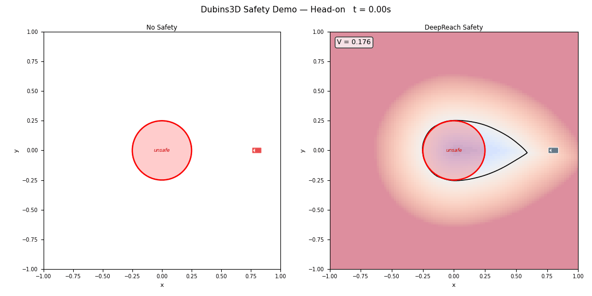
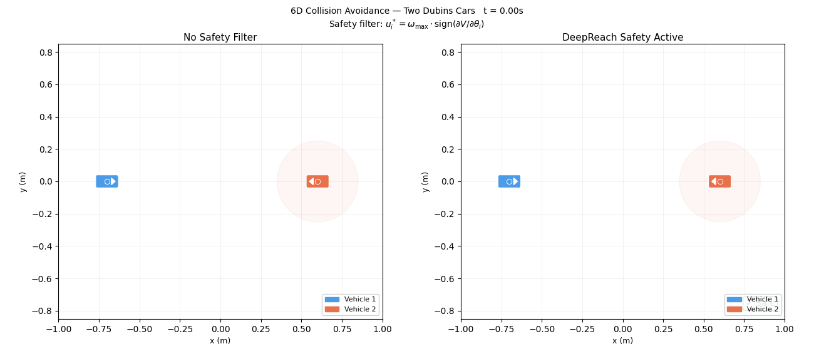
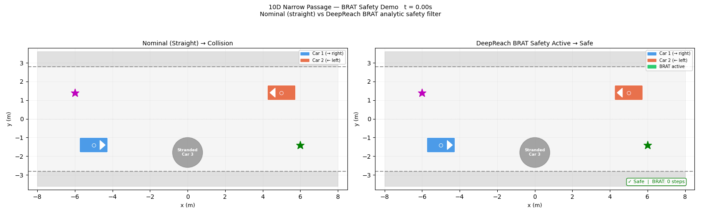

# Baselines — Classical HJ Reachability

Ground-truth Hamilton-Jacobi reachability value functions computed with [`optimized_dp`](https://github.com/SFU-MARS/optimized_dp) (grid-based solver), used to benchmark DeepReach across four scenario families.

---

## Project Structure

```
baselines/
├── config.py                      # Shared physical parameters (matched to dynamics/dynamics.py)
├── compare_values.py              # Grid vs. DeepReach comparison utility (Air3D / Dubins3D)
├── grids/                         # Pre-computed ground-truth value grids (.npy)
├── optimized_dp/                  # Grid solvers and dynamics wrappers
│   ├── air3d_solve.py
│   ├── dubins3d_solve.py
│   ├── collision6d_solve.py
│   ├── scalability_demo.py
│   └── dynamics/
├── dubins3d/                      # Dubins car — 3D avoidance
│   ├── analysis.py
│   ├── demo.py
│   └── plots/
├── air3d/                         # Air3D pursuit-evasion — 3D
│   ├── analysis.py
│   ├── analysis_normtrain.py
│   └── plots/
├── collision6d/                   # Two-vehicle collision — 6D
│   ├── analysis.py
│   ├── demo.py
│   ├── compare_values.py
│   └── plots/
├── collision9d/                   # Multi-vehicle collision — 9D
│   ├── analysis.py
│   └── plots/
└── narrow_passage_10d/            # Narrow passage BRAT — 10D
    ├── analysis.py
    ├── brat_analysis.py
    ├── brat_demo.py
    └── plots/
```

---

## Setup

Install `optimized_dp` (needed only for re-solving grids):

```bash
git clone https://github.com/SFU-MARS/optimized_dp.git ~/optimized_dp
cd ~/optimized_dp
conda env create -f environment.yml
conda activate odp
pip install -e .
```

Analysis and demo scripts use the `deepreach` conda environment (PyTorch, no `odp` required).

---

## Scenarios

All scripts are run from the **repository root**:

```bash
conda activate deepreach
cd ~/deepreach_CMPT419
```

---

### Dubins3D — 3D Single-Vehicle Avoidance

A single Dubins car (state: `x, y, θ`) avoids a circular obstacle. The DeepReach SIREN model is compared against the optimized_dp ground-truth grid (101 pts/dim).

**Metrics:** MSE = 0.027, BRT vol error = 4.3%

| Script | Description |
|---|---|
| `optimized_dp/dubins3d_solve.py` | Solve 101-pt grid (run in `odp` env) |
| `dubins3d/analysis.py` | Value function comparison, BRT overlay, gradient quiver, control field, metrics |
| `dubins3d/demo.py` | Safety simulation: nominal vs. DeepReach override; outputs PNG snapshots + animated GIF |

```bash
python baselines/dubins3d/analysis.py
python baselines/dubins3d/demo.py
```

**Demo:**



---

### Air3D — 3D Pursuit-Evasion

Two aircraft in relative coordinates (state: `x, y, ψ`). DeepReach is compared against the optimized_dp ground-truth (101 pts/dim). The base model (lr=1e-4) diverged after ~12k epochs; the reported metrics are for the retrained **lr5 model** (lr=1e-5, 120k epochs). `analysis_normtrain.py` runs a separate replication study comparing lr5 vs. a no-pretrain normtrain variant.

**Metrics (lr5 model):** MSE = 0.025, BRT vol error = 6.24%, Control agreement = 75.2%

| Script | Description |
|---|---|
| `optimized_dp/air3d_solve.py` | Solve 101-pt grid (run in `odp` env) |
| `air3d/analysis.py` | Value comparison, BRT overlays, gradient quiver, control field, metrics (lr5 model) |
| `air3d/analysis_normtrain.py` | Three-panel comparison: ground truth vs. lr5 vs. normtrain (no-pretrain) model |

```bash
python baselines/air3d/analysis.py
python baselines/air3d/analysis_normtrain.py
```

---

### Collision6D — Two-Vehicle Collision Avoidance

Two Dubins cars in a shared 2D plane (state: `x1, y1, x2, y2, θ1, θ2`). Grid-based ground truth is computed at 11, 15, and 21 pts/dim to study resolution sensitivity. DeepReach learns a cooperative safety filter.

**Metrics:** MSE = 0.003, BRT vol error = 18.4% (ground truth limited by grid resolution)

| Script | Description |
|---|---|
| `optimized_dp/collision6d_solve.py` | Solve grid at configurable resolution (run in `odp` env) |
| `collision6d/analysis.py` | Value comparison, resolution sensitivity, BRT overlay, gradient quiver, isosurface |
| `collision6d/demo.py` | Safety simulation: head-on crash vs. cooperative avoidance; outputs PNG + animated GIF |
| `collision6d/compare_values.py` | Grid vs. model comparison utility |

```bash
python baselines/collision6d/analysis.py
python baselines/collision6d/demo.py
```

**Demo:**



---

### Collision9D — Multi-Vehicle Collision

Three-vehicle collision scenario (state dim = 9). No classical ground truth is available at this dimensionality — analysis focuses on value function slices, gradient structure, BRT isosurface, and admissibility checks.

| Script | Description |
|---|---|
| `collision9d/analysis.py` | Value slices, gradient quiver, BRT isosurface, admissibility check, training loss, metrics |

```bash
python baselines/collision9d/analysis.py
```

---

### Narrow Passage 10D — BRAT Safety Filter

Two bicycle-model cars navigate a narrow corridor past a stranded vehicle (state dim = 10). Uses a Backward Reachable Avoid Tube (BRAT) formulation — the neural net certifies that a safe trajectory to the goal exists while avoiding all obstacles.

**Finding:** The analytic avoid_fn gradient filter succeeds; the raw NN gradient (∇V) fails because the reach component dominates ∂V/∂x throughout the avoidance phase. Full discussion in docs/CHANGES.md.

| Script | Description |
|---|---|
| `narrow_passage_10d/analysis.py` | Value slices, gradient quiver, BRT isosurface, metrics (`lr5` model) |
| `narrow_passage_10d/brat_analysis.py` | BRAT-specific value slices, corridor sweep, metrics |
| `narrow_passage_10d/brat_demo.py` | Full demo + Phase 3/4 NN gradient diagnostics (long runtime) |
| `narrow_passage_10d/make_gif.py` | Lightweight standalone: nominal crash vs. BRAT safe, GIF only |

```bash
python baselines/narrow_passage_10d/analysis.py
python baselines/narrow_passage_10d/brat_analysis.py
python baselines/narrow_passage_10d/make_gif.py   # fast GIF only
# python baselines/narrow_passage_10d/brat_demo.py  # full run (long)
```

**Demo:**



---

## Comparing DeepReach vs. Ground Truth

`compare_values.py` supports two modes for 3D scenarios (Air3D / Dubins3D):

**Mode A** — grid vs. grid (no GPU):
```bash
conda activate odp
python baselines/compare_values.py \
  --baseline_grid baselines/grids/dubins3d_grid.npy \
  --deepreach_grid path/to/deepreach_values.npy
```

**Mode B** — grid vs. `.pth` model:
```bash
conda activate deepreach
python baselines/compare_values.py \
  --baseline_grid baselines/grids/air3d_grid.npy \
  --deepreach_model runs/air3d_run_lr5/training/checkpoints/model_epoch_110000.pth \
  --dynamics air3d
```

For 6D comparison, use `baselines/collision6d/compare_values.py` with the same flags.

---

## Shared Parameters

`config.py` defines physical constants (velocity, omega_max, goal radius, T_max, grid resolution) matched exactly to `dynamics/dynamics.py` to ensure grid and neural-net evaluations are on the same domain.
